# Git管理源代码

**场景图**


**学习目标**

- 能够说出git的作用和管理源代码的特点
- 能够如何创建git仓库并添加忽略文件
- 能够使用add、commit、push、pull等命令实现源代码管理
- 能够使用github远程仓库托管源代码
- 能够说出代码冲突原因和解决办法
- 能够说出 git 标签的作用
- 能够使用使用git实现分支创建，合并操作

## 1 . Git简介

**Git**

- Git 是目前世界上最先进的分布式版本控制系统（没有之一）

**作用**

- 源代码管理

**为什么要进行源代码管理?**

- 方便多人协同开发
- 方便版本控制

**Git的诞生**

- 作者是 Linux 之父：Linus Benedict Torvalds
- 当初开发 Git 仅仅是为了辅助 Linux 内核的开发（管理源代码）


> git 开发时间表
>
> - git 的产生是 Linux Torvals 在无奈被逼的情况下创造的，我看了一下时间历程：
>   - 2005 年 4 月3 日开始开发 git
>   - 2005 年 4 月 6 日项目发布
>   - 2005 年 4 月 7 日 Git 开始作为自身的版本控制工具
>   - 2005 年 4 月 18 日发生第一个多分支合并
>   - 2005 年 4 月 29 日 Git 的性能达到 Linux 预期
>   - 2005年 7 月 26 日 Linux 功成身退，将 Git 维护权交给 Git 另一个主要贡献者 Junio C Hamano，直到现在
>
> Git 迅速成为最流行的分布式版本控制系统，尤其是 2008 年，GitHub 网站上线了，它为开源项目免费提供 Git 存储，无数开源项目开始迁移至 GitHub，包括 jQuery，PHP，Ruby 等等

**Git管理源代码特点**

- 1.`Git`是分布式管理.服务器和客户端都有版本控制能力,都能进行代码的提交、合并、...

  

- 2.`Git`会在根目录下创建一个`.git`隐藏文件夹，作为本地代码仓库

  

**Git操作流程图解**

```
Git服务器 --> 本地仓库 --> 客户端 --> 本地仓库 --> Git服务器

```

 


## 2 . 工作区暂存区和仓库区


**工作区**

- 对于`添加`、`修改`、`删除`文件的操作，都发生在工作区中

**暂存区**

- 暂存区指将工作区中的操作完成小阶段的存储，是版本库的一部分

**仓库区**

- 仓库区表示个人开发的一个小阶段的完成
  - 仓库区中记录的各版本是可以查看并回退的
  - 但是在暂存区的版本一旦提交就再也没有了

## 3. Git 单人本地仓库操作

- 提示：本地仓库是个`.git`隐藏文件

> 以下为演示Git单人本地仓库操作

- **1.安装git**

  ```
    sudo apt-get install git
    密码：chuanzhi

  ```

  

- **2.查看git安装结果**

  ```
    git

  ```

- **3.创建项目**

  - 在桌面创建`test`文件夹，表示是工作项目

    ```
      Desktop/test/

    ```

- **4.创建本地仓库**

  - 进入到`test`，并创建本地仓库`.git`

  - 新创建的本地仓库`.git`是个空仓库

    ```
      cd Desktop/test/
      git init

    ```

    

  - 创建本地仓库`.git`后

    

- **5.配置个人信息**

  ```
    git config user.name '张三'
    git config user.email 'zhangsan@163.com'

  ```

  

  - 配置个人信息后

    

> 默认不配置的话，会使用全局配置里面的用户名和邮箱 全局git配置文件路径：~/.gitconfig

- **6.新建py文件**

  - 在项目文件`test`里面创建`login.py`文件，用于版本控制演示

    

- **7.查看文件状态**

  - 红色表示新建文件或者新修改的文件,都在工作区.

  - 绿色表示文件在暂存区

  - 新建的`login.py`文件在工作区，需要添加到暂存区并提交到仓库区

    ```
    git status

    ```

    

- **8.将工作区文件添加到暂存区**

  ```
    # 添加项目中所有文件
    git add .
    或者
    # 添加指定文件
    git add login.py

  ```

  

- **9.将暂存区文件提交到仓库区**

  - `commit`会生成一条版本记录

  - `-m`后面是版本描述信息

    ```
    git commit -m '版本描述'

    ```

    

- **10.接下来就可以在login.py文件中编辑代码**

  - 代码编辑完成后即可进行`add`和`commit`操作

  - 提示：添加和提交合并命令

    ```
      git commit -am "版本描述"

    ```

  - 提交两次代码，会有两个版本记录

    

- **11.查看历史版本**

  ```
    git log
    或者
    git reflog

  ```

  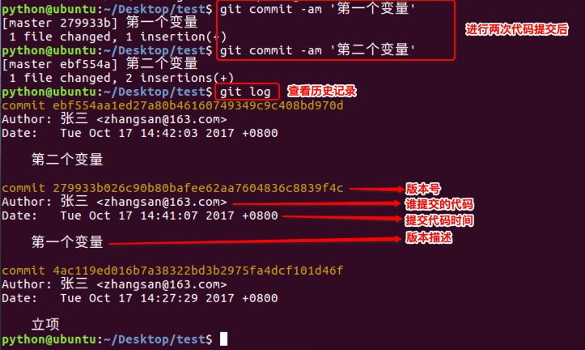

> git reflog 可以查看所有分支的所有操作记录（包括commit和reset的操作），包括已经被删除的commit记录，git log 则不能察看已经删除了的commit记录

- **12.回退版本**

  - **方案一：**

    - `HEAD`表示当前最新版本

    - `HEAD^`表示当前最新版本的前一个版本

    - `HEAD^^`表示当前最新版本的前两个版本，**以此类推...**

    - `HEAD~1`表示当前最新版本的前一个版本

    - `HEAD~10`表示当前最新版本的前10个版本，**以此类推...**

      ```
      git reset --hard HEAD^

      ```

      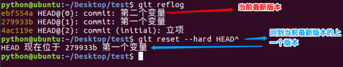

      

  - **方案二：当版本非常多时可选择的方案**

    - 通过每个版本的版本号回退到指定版本

      ```
        git reset --hard 版本号

      ```

      

      

- **13.撤销修改**

  - 只能撤销工作区、暂存区的代码,不能撤销仓库区的代码

  - 撤销仓库区的代码就相当于回退版本操作

    - 撤销工作区代码

      - 新加代码`num3 = 30`，不`add`到暂存区，保留在工作区

        ```
        git checkout 文件名

        ```

        

        

    - 撤销暂存区代码

      - 新加代码`num3 = 30`，并`add`到暂存区

        ```
        # 第一步：将暂存区代码撤销到工作区
        git reset HEAD  文件名
        # 第二步：撤销工作区代码
        git checkout 文件名

        ```

        

- **14.对比版本**

  - 对比版本库与工作区

    - 新加代码`num3 = 30`，不`add`到暂存区，保留在工作区

    - `git diff HEAD -- login.py`

      

  - 对比版本库

    - 新加代码`num3 = 30`，并`add`到暂存区

    - `git diff HEAD HEAD^ -- login.py`

      

- **15.删除文件**：删除文件分为确定删除和误删

  - 在项目中新建`test.py`文件，并添加和提交到仓库

    - 确定删除处理：

      ```
        # 删除文件
        rm 文件名
        # git确定删除文件，对比添加文件git add 
        git rm 文件名
        # 删除后记录删除操作版本
        git commit -m '删除描述'

      ```

      

    - 误删处理：撤销修改即可

      ```
        # 删除文件
        rm 文件名
        # git撤销修改
        git checkout -- 文件名

      ```

      


## 4 . Git 远程仓库Github

**Git远程仓库Github**

> 提示：Github网站作为远程代码仓库时的操作和本地代码仓库一样的，只是仓库位置不同而已！

- 准备Git源代码仓库 `https://github.com/`
- 准备经理的文件 `Desktop/manager/`
- 准备张三的文件 `Desktop/zhangsan/`

### 4.1 创建远程仓库

> 以下操作为演示在Github网站上创建远程仓库

- 1.登陆注册Github

- 2.创建仓库入口

  

- 3.编辑仓库信息

  

- 4.仓库创建完成

  

- 5.查看仓库地址

  - 远程仓库地址`https://github.com/zhangxiaochuZXC/test007.git` 

### 4.2 克隆项目

- 准备经理的文件 `Desktop/manager/`
- 准备张三的文件 `Desktop/zhangsan/`

**经理的工作**

- 立项：克隆远程仓库+配置身份信息+创建项目+推送项目到远程仓库

- 1.克隆远程仓库的命令

  ```
    cd Desktop/manager/
    git clone https://github.com/zhangxiaochuZXC/test007.git

  ```

- 2.克隆远程仓库到本地

  


- 3.克隆成功后查看经理的文件

  

- 4.配置经理身份信息

  ```
    cd Desktop/manager/test007/
    git config user.name '经理'
    git config user.email 'manager@163.com'

  ```

  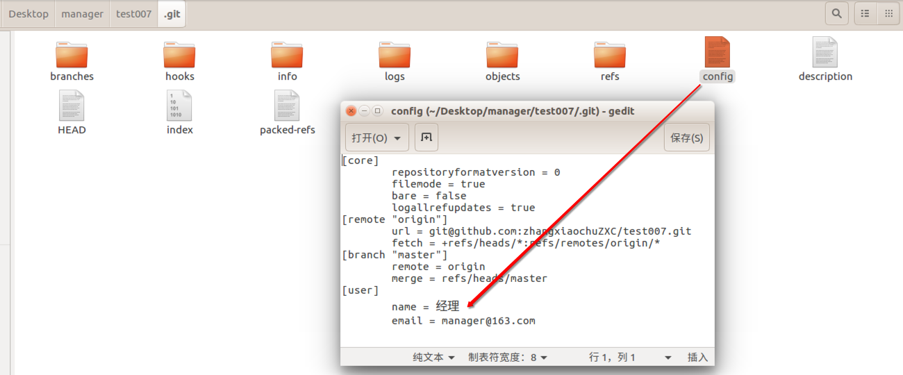

- 5.创建项目

  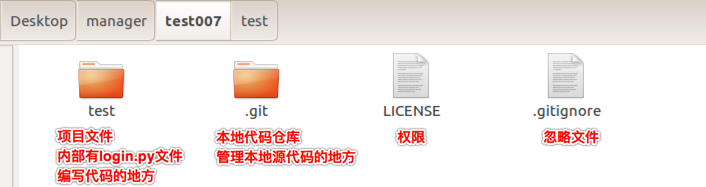

- 6.推送项目到远程仓库

  ```
    # 工作区添加到暂存区
    git add .
    # 暂存区提交到仓库区
    git commit -m '立项'
    # 推送到远程仓库
    git push

  ```

  

  

- 在 push 的时候需要设置账号与密码，该密码则是 github 的账号与密码

  - 如果在每次 push 都需要设置账号与密码，那么可以设置记住密码

    ```
    设置记住密码（默认15分钟）：
    git config --global credential.helper cache
    如果想自己设置时间，可以这样做(1小时后失效)：
    git config credential.helper 'cache --timeout=3600'
    长期存储密码：
    git config --global credential.helper store

    ```

    > 在以后的项目开发过程中，Pycharm 可以自动记住密码

**张三的工作**

- 获取项目：克隆项目到本地、配置身份信息

- 1.克隆项目到本地

  ```
    cd Desktop/zhangsan/
    git clone https://github.com/zhangxiaochuZXC/test007.git

  ```

  

- 2.克隆成功后查看张三的文件

  

- 3.配置张三身份信息

  ```
    cd Desktop/zhangsan/test007/
    git config user.name '张三'
    git config user.email 'zhangsan@163.com'

  ```

> 张三身份信息配置成功后即可跟经理协同开发同一个项目

### 4.3 多人协同开发

- 1.代码编辑界面介绍：此处使用`gedit`做演示

  - 代码编辑界面左边为模拟经理的操作

  - 代码编辑界面右边为模拟张三的操作

    

- 2.模拟张三先编辑`login.py`文件代码

  - 进入张三本地仓库：`cd Desktop/zhangsan/test007`

  - 编辑代码：`num1 = 10`

  - 本地仓库记录版本：`git commit -am '第一个变量'`

  - 推送到远程仓库：`git push`

    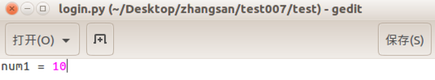

    

    

- 3.模拟经理后编辑`login.py`文件代码

  - 进入经理本地仓库：`cd Desktop/manager/test007/`

  - 经理同步服务器代码：`git pull`

  - 编辑代码：`num2 = 20`

  - 本地仓库记录版本：`git commit -am '第二个变量'`

  - 推送到远程仓库：`git push`

    

    

    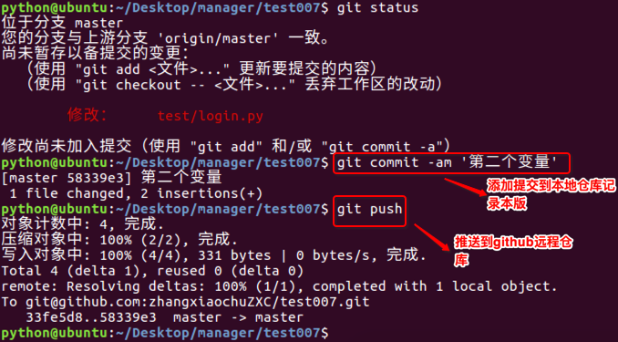.

    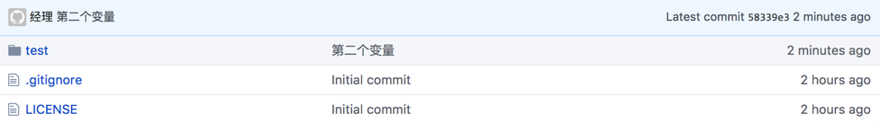

- 4.模拟张三同步服务器代码

  - 本次可以把`num2`同步到张三的本地仓库

    

- 5.按照以上`2-3-4`步骤循环操作，即可实现基本的协同开发

- 6.总结：

  - 要使用git命令操作仓库，需要进入到仓库内部
  - 要同步服务器代码就执行：`git pull`
  - 本地仓库记录版本就执行：`git commit -am '版本描述'`
  - 推送代码到服务器就执行：`git push`
  - 编辑代码前要先`pull`，编辑完再`commit`，最后推送是`push`
  - -am 需得等下一轮使用

### 4.4 代码冲突

- **提示**：多人协同开发时，避免不了会出现代码冲突的情况
- **原因**：多人同时修改了同一个文件
- **危害**：会影响正常的开发进度
- **注意**：一旦出现代码冲突，必须先解决再做后续开发

**代码冲突演练**

- 1.张三先编辑`login.py`文件代码

  - 进入张三本地仓库：`cd Desktop/zhangsan/test007`

  - 拉取服务器最新代码：`git pull`

  - 编辑代码：`num3 = 30`

  - 本地仓库记录版本：`git commit -am '第三个变量'`

  - 推送到服务器仓库：`git push`

  - 张三本地仓库和远程仓库代码如下：

    

    

- 2.经理后编辑`login.py`文件代码

  - 进入经理本地仓库：`cd Desktop/manager/test007/`

  - 编辑代码：`num3 = 300`

  - 本地仓库记录版本：`git commit -am '第三个变量'`

  - 推送到服务器仓库：`git push`

  - **以上操作会出现代码冲突**

    - 提示需要先pull

      

    - 提示冲突文件

      

    - 冲突代码表现

      

- 3.解决冲突

  - 原则：谁冲突谁解决，并且一定要协商解决

  - 方案：保留所有代码 或者 保留某一人代码

  - 解决完冲突代码后，依然需要`add`、`commit`、`push`

    

    

  - 提示：如果张三执行`pull`没有影响，就算真正解决了冲突代码

**补充：**

- **容易冲突的操作方式**
  - 多个人同时操作了同一个文件
  - 一个人一直写不提交
  - 修改之前不更新最新代码
  - 提交之前不更新最新代码
  - 擅自修改同事代码
- **减少冲突的操作方式**
  - 养成良好的操作习惯,先`pull`在修改,修改完立即`commit`和`push`
  - 一定要确保自己正在修改的文件是最新版本的
  - 各自开发各自的模块
  - 如果要修改公共文件,一定要先确认有没有人正在修改
  - 下班前一定要提交代码,上班第一件事拉取最新代码
  - 一定不要擅自修改同事的代码

### 4.5 标签

**标签**

- 当某一个大版本完成之后,需要打一个标签

- 作用：

  - 记录大版本

  - 备份大版本代码

    

**模拟经理打标签**

- 1.进入到经理的本地仓库`test007`

  ```
   cd Desktop/manager/test007/

  ```

- 2.经理在本地打标签

  ```
   git tag -a 标签名 -m '标签描述'
   例：
   git tag -a v1.0 -m 'version 1.0'

  ```

  

- 3.经理推送标签到远程仓库

  ```
   git push origin 标签名
   例：
   git push origin v1.0

  ```

  

- 4.查看打标签结果

  

- 补充：删除本地和远程标签

  ```
    # 删除本地标签
    git tag -d 标签名
    # 删除远程仓库标签
    git push origin --delete tag 标签名
  ```

### 4.6 分支

**分支**


- 作用：
  - 区分生产环境代码以及开发环境代码
  - 研究新的功能或者攻关难题
  - 解决线上bug
- 特点：
  - 项目开发中公用分支包括master、dev
  - 分支master是默认分支，用于发布，当需要发布时将dev分支合并到master分支
  - 分支dev是用于开发的分支，开发完阶段性的代码后，需要合并到master分支

**模拟经理分支操作**

- 对比：操作分支前的代码

  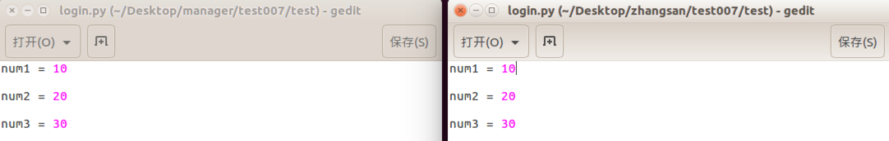

- 1.进入到经理的本地仓库`test007`

  ```
   cd Desktop/manager/test007/

  ```

- 2.查看当前分支

  ```
    git branch

  ```

  - 没有创建其他分支时，只有`master`分支

    

- 3.经理创建并切换到dev分支

  ```
   git checkout -b dev

  ```

  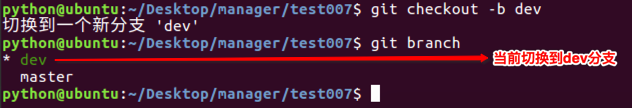

- 4.设置本地分支跟踪远程指定分支（将分支推送到远程）

  ```
    git push -u origin dev

  ```

- 5.经理在dev分支编辑代码

  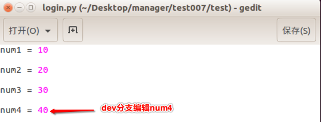

- 6.管理dev分支源代码：`add`、`commit`、`push`

  

  

- 7.dev分支合并到master分支

  - 提示：只有当dev分支合并到master分支成功，张三才能获取到`num4`

  - 7.1 先切换到master分支

    ```
      git checkout master

    ```

    

  - 7.2 dev分支合并到master分支

    ```
      git merge dev

    ```

    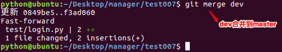

  - 7.3 经理推送合并分支操作到远程仓库

    - 合并分支默认在本地完成，合并后直接推送即可

      ```
      git push

      ```

      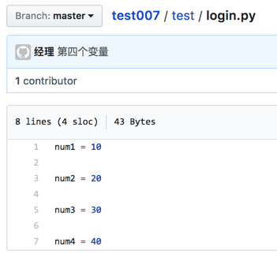

- 8.张三同步经理合并后的`num4`

  - 只有当张三同步代码成功，分支合并才算成功

    ```
      cd Desktop/zhangsan/test007/
      git pull

    ```

    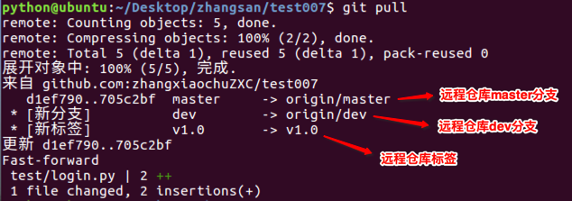

    

### 4.7 SSH配置

**设置SSH Key**

**在注册好github账号后，打开你的电脑桌面上的一个文件夹，这就建立了一个本地工作库，在里面点击鼠标右键，找到你的git bash here-点击开，如图所示：进行下面操作：**

- 输入cd ~/.ssh——回车（看你是否有了ssh key 密钥，有了就备份）；
  
- 输入ssh-keygen -t rsa -C "your email"——直接回车，之后会让你输入github的账号密码，会出现如图所示结果，跟着上面所指示的路径，在你的电脑中找到该文件，id_rsa文件即是你的私有密钥，id_rsa.pub是共开密钥
  
- 打开你的id_rsa.pub文件，复制下里面的内容，然后登录进去你的github；
  
- 在右上角账户那里点击头像边上的下拉，出现如图——点击settings进去，找到左侧的SSH Keys,点击，如图；
  


- 在点击Add SSH Key，在title处填入任意的标识，在Key部分里面添加刚才复制的id_rsa.pub文件里的内容，点击添加即可；
  
- 最后一步了，只需测试一下链接是否正常了，接着输入：ssh -T [git@github.com](mailto:git@github.com)，这时会问是否继续连接，我们输入 yes，这样，我们的git配置就完成了。