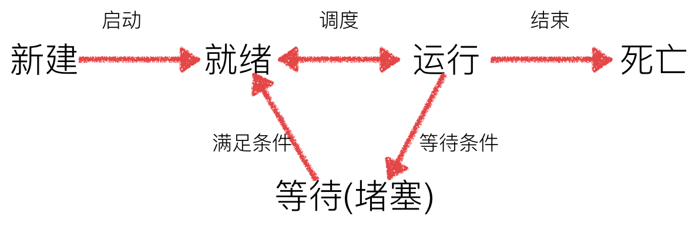

# 多任务编程

# 1 线程

## 1.1含义

操作系统可以同时运行多个任务

## 1.2 并行和并发

### 1.2.1 并行

指在同一时刻,有多条指令在多个处理器上同时执行,就是VIP服务 一对一教学

### 1.2.2 并发

指在同一时刻只能有一条指令执行,但多个进程指令被快速的轮换执行,使得在宏观上具有多个进程同时执行的效果,但实际上是快速交替执行,(时间片轮转)

## 1.3 单任务编程

同一时刻只能执行一个程序

## 1.4 多线程实现多任务

### 1.4.1 含义

一个程序启动时,即在一个单独的线程中运行,是主线程,新创建的线程是子线程

### 1.4.2 内容

这里面需要导入 `threading`模块

创建线程

```
t1 = threading.Thread(target=a)
```

启动线程

`ti.start()`

代码实现

```
import time
import threading


def a():
    for i in range(5):
        print("aaaa")
        time.sleep(1)


def b():
    for i in range(5):
        print("bbbbb")
        time.sleep(1)


def main():
    """程序入口"""
    # 创建两个线程
    # 功能: 创建线程,同时指定线程处理函数,这里只是创建线程,线程还没起作用
    # 参数: 指定的线程处理函数,参数需要以命名方式传递参数,传递的是函数名字,没有()
    # 返回值: 就是一个线程对象
    t1 = threading.Thread(target=a)
    t2 = threading.Thread(target=b)
    # 启动线程
    t1.start()
    t2.start()

    for i in range(5):
        print("ccc")
        time.sleep(1)


if __name__ == '__main__':
    main()
```

### 1.4.3 线程数量验证

`threading.enumerate()` 返回当前线程信息,以列表方式返回

```
import time
import threading


def a():

    print("aaaa")
    time.sleep(1)


def b():

    print("bbbbb")
    time.sleep(1)

# threading.enumerate()功能 返回当前线程信息,以列表方式返回
print("1=", threading.enumerate())

print("主线程")

print("2=", threading.enumerate())
# 创建线程
t1 = threading.Thread(target=a)
t2 = threading.Thread(target=b)
# 启动线程
t1.start()
print("3=", threading.enumerate())
t2.start()
print("4=", threading.enumerate())
```

### 1.4.4 主线程会等所有子线程结束后在轮到它

### 1.4.5 多线程执行顺序随机,不确定

### 1.4.6 用类写线程

#### 1.4.6.1 要求

用类封装时,定义一个Thread的子类创建线程

1. 定义类,继承 `threading.Thread`
2. 这个类`threading.Thread`.中有一个派生类 `run()` 需要重写
3. 只有这个 `run()` 函数是线程函数,函数名不能写别的
4. 通过 `start()` 间接启动

#### 1.4.6.2代码实现

```
import threading, time

class Ai(threading.Thread):
    def run(self):
            print("bbbbb")
            time.sleep(1)


# 创建对象
obi = Ai()
obi.start()
for i in range(5):
    print("ccc")
    time.sleep(1)
```

### 1.4.7 多线程共享全局变量

#### 1.4.7.1 因为是全局变量,所有线程都能调用和改动

代码实现

```
import time
import threading

i = 22

# 线程1处理函数修改内容
def a():
    global i
    i = 11
    print("1", i)


def b():
    print("2", i)


def main():
    """程序入口"""

    t1 = threading.Thread(target=a)
    t2 = threading.Thread(target=b)
    # 启动线程
    t2.start()
    time.sleep(1)
    t1.start()
    time.sleep(1)
    print("3", i)


if __name__ == '__main__':
    main()
```

#### 1.4.7.2 列表当做实参传递到线程中

传参需要用到列表去,和普通函数传参不同

```
import threading


def a(tmp):
    print(tmp)


def main():
    """程序入口"""

    t1 = threading.Thread(target=a, args=((11, 12), ))

    # 启动线程
    t1.start()


if __name__ == '__main__':
    main()
```

#### 1.4.7.3 多线程共享全局变量带来的问题

如果多个线程对同一个全局变量操作,会出现资源竞争的问题,从而数据结果不正确

代码实现

```
import time
import threading

i = 0

def a(n):
    global i
    for j in range(n):
        i += 1
    print("a", i)


def b(n):
    global i
    for j in range(n):
        i += 1
    print("b", i)


def main():
    t1 = threading.Thread(target=a, args=(1000000, ))
    t2 = threading.Thread(target=b, args=(1000000, ))

    t1.start()
    t2.start()
    print("c", i)


if __name__ == '__main__':
    main()
```

### 1.4.8 同步与互斥

#### 1.4.8.1 同步

指不同任务按照某种先后顺序来运行,如: A和B任务运行过程中协同步调,A任务的运行依赖与B任务产生的数据

#### 1.4.8.2 互斥

指某一时刻只能运行一个任务,不结束 其他任务不能运行 如一个公共资源同一时刻只能被一个进程或线程使用，多个进程或线程不能同时使用公共资源

>  同步是一种更为复杂的互斥，而互斥是一种特殊的同步

#### 1.4.8.3 互斥锁

线程同步保证多个线程安全访问竞争资源,同步机制引入互斥锁

互斥锁为资源引入一个状态：锁定/非锁定。

1. 某个线程要更改共享数据时，先将其锁定，此时资源的状态为“锁定”，其他线程不能更改
2. 直到该线程释放资源，将资源的状态变成“非锁定”，其他的线程才能再次锁定该资源
3. 互斥锁保证了每次只有一个线程进行写入操作，从而保证了多线程情况下数据的正确性

代码实现

```
# 创建锁
mutex = threading.Lock()

# 锁定
mutex.acquire()

# 释放
mutex.release()
```

1.4.8.4 使用互斥锁解决多线程共享全局变量的问题

```
import time
import threading

i = 0


def a(n, mutex):
    global i
    for j in range(n):
        mutex.acquire()  # 加锁
        i += 1
        mutex.release()  # 解锁
    print("a", i)


def b(n, mutex):
    global i
    for j in range(n):
        mutex.acquire()  # 加锁
        i += 1
        mutex.release()  # 解锁
    print("b", i)


def main():
    """程序入口"""
    # 创建锁,默认打开
    # 返回一个对象
    mutex = threading.Lock()
    # 创建两个线程
    t1 = threading.Thread(target=a, args=(1000000, mutex))
    t2 = threading.Thread(target=b, args=(1000000, mutex))
    # 启动线程
    t1.start()
    t2.start()
    time.sleep(3)  # 保证子进程都指向完毕

    print("c", i)


if __name__ == '__main__':
    main()
```

#### 1.4.8.5 互斥锁优缺点

锁的好处：

- 确保了某段关键代码只能由一个线程从头到尾完整地执行

锁的坏处：

- 阻止了多线程并发执行，包含锁的某段代码实际上只能以单线程模式执行，效率就大大地下降了
- 由于可以存在多个锁，不同的线程持有不同的锁，并试图获取对方持有的锁时，可能会造成死锁

#### 1.4.8.6 死锁

在线程间共享多个资源的时候，如果两个线程分别占有一部分资源并且同时等待对方的资源，就会造成死锁。尽管死锁很少发生，但一旦发生就会造成应用的停止响应。

这里解决办法是在 `mutex.acquire(timeout = 1)` 1秒后自动解锁

代码实现

```
import time
import threading

g_num = 0


def table1(n, mutex):
    global g_num
    for i in range(n):
        mutex.acquire(timeout = 1)  # 1秒后自动解锁
        g_num += 1
        mutex.release()  # 解锁

    print("table1111", g_num)


def table2(n, mutex):
    global g_num
    for i in range(n):
        mutex.acquire(timeout=1)
        g_num += 1
        mutex.release()
    print("table2222", g_num)


def main():
    """程序入口"""
    # 创建锁,默认是打开的
    # 返回一个对象
    mutex = threading.Lock()

    t1 = threading.Thread(target=table1, args=(5, mutex))
    t2 = threading.Thread(target=table2, args=(5, mutex))

    t1.start()
    t2.start()
    time.sleep(3)  # 保证子进程都执行完毕
    print("table3333", g_num)


if __name__ == '__main__':
    main()
```

# 2 进程

## 2.1 进程简介

平时写的python代码,它是一个程序文件,当这个可执行程序运行起来后(没有结束之前),它就成为了一个进程.

* 程序是存放在存储介质上的一个文件,而进程是程序执行的过程.
* 进程的状态是变化的,其包括进程的创建 调度和消亡.
* 程序是静态的,进程是动态的.

操作系统是通过进程去完成一个一个的任务,进程是管理事务的基本单元,也是操作系统分配资源的基本单元.

进程拥有自己独立的处理环境和系统资源

## 2.2 进程相关命令

### 1) ps

ps命令可以查看进程的详细状况,常用选项(选项可以不加"-")

| 选项   | 含义                   |
| ---- | -------------------- |
| -a   | 显示终端上的所有进程，包括其他用户的进程 |
| -u   | 显示进程的详细状态            |
| -x   | 显示没有控制终端的进程          |
| -j   | 列出与作业控制相关的信息         |

显示当前用户下所有进程: `ps -aux`

### 2) kill

kill命令功能:发送指定的信号到相应进程,大部分默认的动作是终止指定的进程

## 2.3 进程状态

进程状态工作中,任务数往往大于cpu核数,一定有一些任务正在执行,而另一些在等待cpu进行执行,因此导致有了不同的状态



* 就绪态: 运行的条件都已经满足,正在等待cpu执行
* 执行态: cpu正在执行其功能
* 等待态: 等待某些条件满足,例如一个程序sleep了,此时就处于等待态

[   注意:就绪态和等待态都是不执行,但它们是有区别的,就绪态是指满足条件,时间没到,等待态是不满足条件

## 2.4 进程的使用

multiprocessing模块就是跨平台版本的多进程模块,提供了一个Process类来代表一个进程对象,这个对象可以理解为一个独立的进程,可以执行另外的事情

创建一个队列 `Process`  然后用 `start()`  调用

### 1) 代码实现

```
import multiprocessing, time


def fen_dian_1():
    while True:
        print("111111分店")
        time.sleep(1)


def fen_dian_2():
    while True:
        print("222222分店")
        time.sleep(1)


def main():
    # 创建2进程
    # 功能: 创建进程,返回一个对象
    # 参数使用和线程一样
    p1 = multiprocessing.Process(target=fen_dian_1)
    p2 = multiprocessing.Process(target=fen_dian_2)

    # 不能直接调用进程处理函数,需要通过start()间接调用
    p1.start()
    p2.start()

    while True:
        print("3333总店")
        time.sleep(1)


if __name__ == '__main__':
    main()
    
```

### 2) Process 语法

```
multiprocessing.Process(group=None, target=None, name=None, args=(), kwargs={}, *, daemon=None)
```

* group: 指定进程组,大多数情况下用不到
* target: 如果传递了函数的引用,可以任务这个子进程执行这里面的代码
* name: 给进程设定一个名字,可以不设定
* args: 给target指定的函数传递的参数,以元组的方式传递
* kwargs: 给target指定的函数传递命名参数
* daemon: 是否以守护进程运行, True或False

**Process创建的实例对象的常用方法：**

- start()：启动子进程实例（创建子进程）
- is_alive()：判断进程子进程是否还在活着
- join([timeout])：是否等待子进程执行结束，或等待多少秒
- terminate()：不管任务是否完成，立即终止子进程

**Process创建的实例对象的常用属性：**

- name：当前进程的别名，默认为Process-N，N为从1开始递增的整数
- pid：当前进程的pid（进程号）

## 2.5 进程号

每个进程都有一个进程号来标识,进程号总是唯一的

```
import multiprocessing, time, os


def fen_dian_1():
    # os.getppid() 查看当前进程的父进程pid
    while True:
        print("111111分店pid=%d, ppid=%d", (os.getpid(), os.getppid()))
        time.sleep(1)


def fen_dian_2():
    while True:
        print("222222分店pid=%d,ppid=%d", (os.getpid(), os.getppid()))
        time.sleep(1)


def main():
    # 创建2进程
    # 功能: 创建进程,返回一个对象
    # 参数使用和线程一样
    p1 = multiprocessing.Process(target=fen_dian_1)
    p2 = multiprocessing.Process(target=fen_dian_2)

    # 不能直接调用进程处理函数,需要通过start()间接调用
    p1.start()
    p2.start()

    # os.getpid() 查看当前进程PID
    # pid process id
    # ppid parent process id
    while True:
        print("333333总店", os.getpid())
        time.sleep(1)


if __name__ == '__main__':
    main()

```

## 2.6 给子进程指定的函数传递参数

```
import multiprocessing


def fen_dian_1(*args, **kwargs):
    # os.getppid() 查看当前进程的父进程pid
    # while True:
    print(args)
    print(kwargs)


def main():
    # 创建2进程
    # 功能: 创建进程,返回一个对象
    # 参数使用和线程一样
    p1 = multiprocessing.Process(target=fen_dian_1, args=("a", 1), kwargs={"b":2, "c":3, "d":4})


    # 不能直接调用进程处理函数,需要通过start()间接调用

    p1.start()
    p1.join()  # 等待P1执行结束,才能往下执行
    print("父进程")


if __name__ == '__main__':
    main()

```

## 2.7 进程间不同享全局变量

```
import multiprocessing
g_num = 666


def fen_dian_1():
    global g_num
    g_num = 123
    print("fendian1", g_num)


def fen_dian_2():
    print("fendian2", g_num)


def main():
    # 创建2进程
    # 功能: 创建进程,返回一个对象
    # 参数使用和线程一样
    p1 = multiprocessing.Process(target=fen_dian_1)
    p2 = multiprocessing.Process(target=fen_dian_2)

    p1.start()
    p1.join()
    p2.start()
    p2.join()


    print("总店", g_num)


if __name__ == '__main__':
    main()

```

## 2.8 进程和线程的区别

### 1) 进程

进程消耗资源大

进程不共享全局变量 不好传递数据

### 2) 线程

线程在进程中 

线程共享全局变量 资源竞争 数据混乱

## 2.9 进程间通信: Queue

进程是一个独立的资源分配单元,不同进程(这里说的进程通常指的是用户进程)之间的资源是独立的,没有关联,不能在一个进程中直接访问另一个进程的资源

但是,进程不是孤立的,不同进程需要进行信息的交互和状态的传递等,因此需要进程间通信(IPC: Inter Processes Communication).

使用 `multiprocessing` 模块的Queue实现多进程之间的传递

```
import multiprocessing, time

# 这个进程往队列写东西
def jincheng1(q):
    buf = "hello"
    for v in buf:
        # 参数就是放的内容
        q.put(v)  # put 后最好加一个简单的延时
        print("放的内容为:", v)
        time.sleep(1)

# 这个进程取内容
def jincheng2(q):
    # q.empty()这个队列是否为空,为空返回True
    while True:
        # 从这个队列中取内容,返回值为取出的内容
        v = q.get()
        print("取出V=", v)

        if q.empty(): # 如果为空,跳出循环
            break


def main():
    # 创建一个队列,队列可以理解为管道,一端写内容,另外一端取内容
    # 返回值,就是队列对象,可以传参,写一个数字,不写代表个数不做限制
    q = multiprocessing.Queue()

    # 创建2进程
    # 功能 创建进程,返回一个对象
    # 参数使用和线程一样
    p1 = multiprocessing.Process(target=jincheng1, args=(q, ))
    p2 = multiprocessing.Process(target=jincheng2, args=(q, ))

    p1.start()
    p1.join()
    # 保证p1先执行完毕
    p2.start()


if __name__ == '__main__':
    main()
```

初始化Queue()对象时（例如：q = Queue()），若括号中没有指定最大可接收的消息数量，或数量为负值，那么就代表可接受的消息数量没有上限（直到内存的尽头）。

- Queue.qsize()：返回当前队列包含的消息数量
- Queue.empty()：如果队列为空，返回True，反之False
- Queue.full()：如果队列满了，返回True,反之False
- Queue.get([block[, timeout]])：获取队列中的一条消息，然后将其从列队中移除，block默认值为True
  - 如果block使用默认值，且没有设置timeout（单位秒），消息列队如果为空，此时程序将被阻塞（停在读取状态），直到从消息列队读到消息为止，如果设置了timeout，则会等待timeout秒，若还没读取到任何消息，则抛出"Queue.Empty"异常
  - 如果block值为False，消息列队如果为空，则会立刻抛出"Queue.Empty"异常；
- Queue.get_nowait()：相当Queue.get(False)
- Queue.put(item,[block[, timeout]])：将item消息写入队列，block默认值为True
  - 如果block使用默认值，且没有设置timeout（单位秒），消息列队如果已经没有空间可写入，此时程序将被阻塞（停在写入状态），直到从消息列队腾出空间为止，如果设置了timeout，则会等待timeout秒，若还没空间，则抛出"Queue.Full"异常
  - 如果block值为False，消息列队如果没有空间可写入，则会立刻抛出"Queue.Full"异常
- Queue.put_nowait(item)：相当Queue.put(item, False)

## 2.10 进程池POOl

### 2.10.1 进程池的使用

当需要创建的子进程数量不多时，可以直接利用multiprocessing中的Process动态成生多个进程，但如果是上百甚至上千个目标，手动的去创建进程的工作量巨大，此时就可以用到multiprocessing模块提供的Pool方法。

初始化Pool时，可以指定一个最大进程数，当有新的请求提交到Pool中时，如果池还没有满，那么就会创建一个新的进程用来执行该请求；但如果池中的进程数已经达到指定的最大值，那么该请求就会等待，直到池中有进程结束，才会用之前的进程来执行新的任务。

**multiprocessing.Pool常用函数解析：**

- apply_async(func[, args[, kwds]])：使用非阻塞方式调用func（并行执行，堵塞方式必须等待上一个进程退出才能执行下一个进程），args为传递给func的参数列表，kwds为传递给func的关键字参数列表
- close()：关闭Pool，使其不再接受新的任务
- terminate()：不管任务是否完成，立即终止
- join()：主进程阻塞，等待子进程的退出， 必须在close或terminate之后使用

```
import time, multiprocessing, random, os

def work(n):
    print("%d 开始执行: pid=%d" % (n, os.getpid()))
    s_time = time.time()  # 开始时间
    # random.random()产生随机数在0~1之间
    time.sleep(random.random())

    e_time = time.time()  # 结束时间
    print("%d 结束, 耗时%2f,pid=%d" % (n, e_time-s_time, os.getpid()))


def main():
    # 创建一个进程池,有3个进程
    # 返回一个对象
    po = multiprocessing.Pool(3)

    # 创建进程,指定进程函数
    # 耗时在创建进程,销毁进程
    for i in range(10):
        # 将函数添加到进程队列,没有添加到进程中
        po.apply_async(work, args=(i, ))
    po.close()  # 不能再往队列中添加任务
    po.join()  # 等待进程池工作完毕

if __name__ == '__main__':
    main()
```

### 2.10.2 进程池中的	Queue

如果要使用pool创建进程,就需要使用multiprocessing.Manager()中的Queue()

## 2.11 多进程拷贝文件

```
import multiprocessing, time, os

def copyFile(q, fileName, srcFolderName, destFolderName):
    """完成文件的copy"""
    print("正在copy文件%s" % fileName)

    srcFile = open(srcFolderName + "/" + fileName, "rb")  # 读方式打开
    destFile = open(destFolderName + "/" + fileName, "wb") # 写方式打开

    # 读取源文件内容,拷贝到目标文件
    content = srcFile.read()
    destFile.write(content)

    # 关闭文件
    srcFile.close()
    destFile.close()

    # 适当延时
    time.sleep(0.2)

    # 文件名放入Queue中
    q.put(fileName)


def main():
    """完成整体的控制"""
    # 获取需要copy的文件夹的名字
    srcFolderName = input("请输入要copy的文件夹的名字:")

    # 根据需要copy的文件夹的名字,整理一个新的文件夹的名字
    destFolderName = srcFolderName + "[复件]"

    # 创建一个新的文件夹
    try:
        os.mkdir(destFolderName)
    except Exception as ret:
        pass

    # 获取文件夹中需要copy的文件名字
    fileNameList = os.listdir(srcFolderName)

    # 创建一个队列

    q = multiprocessing.Manager().Queue()

    # 创建一个进程池,完成copy
    pool = multiprocessing.Pool(5)

    # 向进程池中添加任务
    for fileName in fileNameList:
        pool.apply_async(copyFile, (q, fileName, srcFolderName,destFolderName))

    allNum = len(fileNameList)
    currentNum = 0
    while True:
        fileName = q.get()  # 取出完成的文件名
        currentNum += 1

        print("已经完成了从%s---(%s)---->%s" % (srcFolderName, fileName, destFolderName))
        print("\r进度%0.2f%%" % (100*currentNum/allNum), end="")

        # 拷贝完成
        if currentNum == allNum:
            break

    # 不再向进程池中添加任务,并且等待所有的任务结束
    pool.close()
    pool.join()

    print("\n\nok..")


if __name__ == '__main__':
    main()
```

# 3 协程

## 3.1 迭代器

迭代是访问集合元素的一种方式. 迭代器是一个可以记住遍历的位置的对象.迭代器对象从集合的第一个元素开始访问,直到所有的元素被访问完结束. 迭代器只能往前不会后退

### 3.1.1 可迭代对象

字符串 列表 元组 字典 可迭代,只要可迭代可以通过For循环取出元素

* 通过for循环遍历打印每一个字符
* 迭代遍历
* 迭代有一个可以记住遍历的位置的对象
* 只能往前不会后退

这样的对象称之为可迭代对象

### 3.1.2 判断一个类型是否可以迭代

可以使用isinstance() 判断一个对象是否是 Iterable 对象:

```
isinstance(666, Iterable)
```

```
 isinstance(666, Iterable) 判断666是否可以迭代,可以返回True,失败返回False
```

### 3.1.3 可迭代对象的本质

可迭代对象本质就是通过迭代器对其进行迭代遍历使用

```
from collections import Iterable  # Iterable可迭代的 能迭代
import time

class MyList(object):
    def __init__(self):
        self.num_list = []  # 空列表

    def add(self, num):
        # 列表追加元素
        self.num_list.append(num)
    # 如果一个类型可以迭代,这个必须定义__iter__()方法
    # __iter__()返回一个对象的引用,这个对象是谁无所谓,左边下划线为2个,右边也是一样
    # 但是这个对象的类中,需要定义__next__()方法
    def __iter__(self):
        print("11111")
        return MyIterator()  # 返回一个对象的引用


# 创建另外一个类,这个类专门用于计算位置,返回内容
# 迭代有一个可以记住遍历的位置的对象
# 只能往前不会后退
class MyIterator(object):
    def __next__(self):
        print("22222")
        return 666


# 创建对象
num_list = MyList()
# 给对象添加内容
num_list.add(11)
num_list.add(22)
num_list.add(33)

# 判断num_list是否可迭代
print(isinstance(num_list, Iterable))  # 返回True
# iter() returned non-iterator of type 'NoneType'
for v in num_list:
    print(v)
    time.sleep(0.5)
```

### 3.1.4 iter()函数与next()函数

#### 3.1.4.1 iter()

通过iter()函数获取这些可迭代对象的迭代器

```
from collections import Iterable
from collections import Iterator

num_list = [11, 22, 33]

# 判断是不是可迭代对象,迭代器
# num_list它是可迭代对象,不是迭代器
print("isinstance(num_list, Iterable) = ", isinstance(num_list, Iterable))
print("isinstance(num_list, Iterator) = ", isinstance(num_list, Iterator))

# iter函数，把迭代对象转换为迭代器
tmp = iter(num_list)
print("isinstance(tmp, Iterator) = ", isinstance(tmp, Iterator))

for v in tmp:
    print("v = ", v)
```

#### 3.1.4.2 next()

对获取到的迭代器不断使用next()函数来获取下一条数据

```
from collections import Iterable  # Iterable可迭代的 能迭代
import time

class MyList(object):
    def __init__(self):
        self.num_list = []  # 空列表
        self.index = 0  # 记录位置

    def add(self, num):
        # 列表追加元素
        self.num_list.append(num)
    # 如果一个类型可以迭代,这个必须定义__iter__()方法
    # __iter__()返回一个对象的引用,这个对象是谁无所谓,左边下划线为2个,右边也是一样
    # 但是这个对象的类中,需要定义__next__()方法
    def __iter__(self):
        return self  # 返回一个对象的引用

    def __next__(self):
        if self.index < len(self.num_list):
            ret = self.num_list[self.index]  # ret = self.num_list[self.index] 取出某个元素
            self.index += 1
            return ret
        else:
            # raise抛出异常,stoplteration为内部异常
            # stoplteration专门给for抛出,for循环捕获到stoplteration,自动跳出循环
            # for循环自动处理stoplteration
            raise StopIteration

# 创建对象
num_list = MyList()
# 给对象添加内容
num_list.add(11)
num_list.add(22)
num_list.add(33)

# 第一次
tmp = num_list.__iter__()

v = next(tmp)
print("v=", v)

v = next(tmp)
print("v=", v)

v = next(tmp)
print("v=", v)
```

​     注意 当迭代完最后一个数据之后,再次调用next() 函数会抛出StopIteration的异常,说明所有数据都已迭代完成,不用再执行next() 函数

### 3.1.5 判断是否为迭代器

可以使用 isinstance() 判断一个对象是否是 Iterator 对象：

```
from collections import Iterable  # Iterable可迭代的 能迭代
from collections import Iterator  # Iterable可迭代的 能迭代
import time

class MyList(object):
    def __init__(self):
        self.num_list = []  # 空列表
        self.index = 0  # 记录位置

    def add(self, num):
        # 列表追加元素
        self.num_list.append(num)
    # 如果一个类型可以迭代,这个必须定义__iter__()方法
    # __iter__()返回一个对象的引用,这个对象是谁无所谓,左边下划线为2个,右边也是一样
    # 但是这个对象的类中,需要定义__next__()方法
    def __iter__(self):
        return self  # 返回一个对象的引用

    def __next__(self):
        if self.index < len(self.num_list):
            ret = self.num_list[self.index]  # ret = self.num_list[self.index] 取出某个元素
            self.index += 1
            return ret
        else:
            # raise抛出异常,stoplteration为内部异常
            # stoplteration专门给for抛出,for循环捕获到stoplteration,自动跳出循环
            # for循环自动处理stoplteration
            raise StopIteration

# 创建对象
num_list = MyList()
# 给对象添加内容
num_list.add(11)
num_list.add(22)
num_list.add(33)

# 第一次
tmp = num_list.__iter__()

while True:
    try:
        v = tmp.__next__()
        print("v = ", v)
    except StopIteration:
        print("遍历完成")
        break

"""
1) 一个类重写了__iter()__方法，它就是可迭代的对象
2) 一个类即重写__iter()__方法，又重写__next__()方法，它就是迭代器
3) 迭代器肯定是可迭代对象，可迭代的对象不一定是迭代器
4) 鱼肯定会游泳，会游泳的不一定是鱼
"""

print(isinstance(num_list, Iterable)) # 判断是否为可迭代对象
print(isinstance(num_list, Iterator)) # 判断是否为迭代器
```

### 3.1.6 迭代器 Iterator

一个实现了iter方法和next方法的对象, 就是迭代器

```
from collections import Iterable
from collections import Iterator

num_list = [11, 22, 33]

# 判断是不是可迭代对象，迭代器
# num_list它是可迭代对象，不是迭代器
print("isinstance(num_list, Iterable) = ", isinstance(num_list, Iterable))
print("isinstance(num_list, Iterator) = ", isinstance(num_list, Iterator))

"""
# 只有迭代器才能使用next()函数
while True:
    try:
        # TypeError: 'list' object is not an iterator
        v = next(num_list)
        print("v = ", v)
    except StopIteration:
        print("遍历完成")
        break
"""

# iter函数，把迭代对象转换为迭代器，返回一个新的对象
tmp = iter(num_list)
print("isinstance(tmp, Iterator) = ", isinstance(tmp, Iterator))

while True:
    try:
        v = next(tmp)
        print("v = ", v)
    except StopIteration:
        print("遍历完成")
        break

```

### 3.1.7 for---in---循环本质

```
# iter函数，把迭代对象转换为迭代器，返回一个新的对象
tmp = iter(num_list)
print("isinstance(tmp, Iterator) = ", isinstance(tmp, Iterator))

while True:
    try:
        v = next(tmp)
        print("v = ", v)
    except StopIteration:
        print("遍历完成")
        break
```

### 3.1.8 迭代器实现数学中有个著名的斐波拉契数列（Fibonacci）

```
# 根据上一个数生成下一个数(生成器，生成器也是迭代器)，无需先拷贝到列表中，节省内存

class Fib(object):
    # n代表元素个数
    def __init__(self, n):
        self.n = n # 元素个数
        # 前2个数的内容
        self.a = 0
        self.b = 1
        #记录位置的变量
        self.index = 0

    # 可迭代对象，重写__iter__()方法
    def __iter__(self):
        return self # 返回一个对象的引用

    # 迭代器需要重写__next__()方法
    def __next__(self):
        if self.index < self.n:
            ret = self.a
            self.a, self.b = self.b, self.a + self.b
            self.index += 1
            return  ret
        else:
            raise StopIteration

# 创建迭代器对象
fib_nums = Fib(5)

for v in fib_nums:
    print(v)


```

## 3.2 生成器

### 3.2.1 简介

利用迭代器，我们可以在每次迭代获取数据（通过next()方法）时按照特定的规律进行生成。

但是我们在实现一个迭代器时，关于当前迭代到的状态需要我们自己记录，进而才能根据当前状态生成下一个数据。

为了达到记录当前状态，并配合next()函数进行迭代使用，我们可以采用更简便的语法，即生成器(generator)。

**生成器是一类特殊的迭代器**。

### 3.2.2 创建生成器

#### 1) 方法1

```
# 列表推导式
list1 = [x for x in range(3)]
print(list1)

# 生成器,把列表推导式的[]改为(),返回值为一个生成器对象,直接打印不能打印元素结果
# 生成器也是迭代器,迭代器可以通过FOR遍历打印
gen = (x for x in range(3))
print(gen)

# for v in gen:
#     print("v=", v)
while True:
    try:
        v = next(gen)
        print("v = ", v)
    except StopIteration:
        print("遍历完成")
        break

```

#### 2) 方法2

只要在 def 中有yield关键字的就称为生成器

```

# 带有yield关键字的函数不是函数，是生成器
# yield的作用，可以让代码暂停执行
def create_fib(n):
    a = 0
    b = 1
    for i in range(n):
        yield a
        a, b = b, a+b

# 返回值不是yield返回的内容， fib_nums它是一个生成器对象，和yield后面有没有跟返回值没有任何关系
# fib_nums和yield关键字有关
fib_nums = create_fib(10)
print(fib_nums)

# v = next(fib_nums)
# print("v = ", v)
#
# v = next(fib_nums)
# print("v = ", v)
#
# v = next(fib_nums)
# print("v = ", v)

# while True:
#     try:
#         v = next(fib_nums)
#         print("v = ", v)
#     except StopIteration:
#         print("遍历完成")
#         break

for v in fib_nums:
    print("v = ", v)
```

在使用生成器实现的方式中,将原本在迭代器next方法中实现的基本逻辑放到一个函数中来实现,将每次迭代返回数值的return换成了yield

#### 3) 总结:

1. 使用了yield关键字的函数不再是函数,而是生成器.
2. yield关键字有两点作用:
   * 保存当前运行状态(断点), 然后暂停执行, 即将生成器挂起
   * 将yield关键字后面表达式的值作为返回值返回,起到return作用
3. 可以使用next()函数让生成器从断点处继续执行,唤醒生成器
4. python3中的生成器可以使用return返回最终运行的返回值, 而python2中的生成器不允许使用return返回一个返回值(可以使用return从生成器中退出,但return后不能有任何表达式)

#### 4) 使用send唤醒

使用send()函数可以在唤醒的同时向断点处传入一个附加数据

```
"""
0, 1, 1, 2, 3, 5, 8, 13, 21, 34
"""

# 带有yield关键字的函数不是函数，是生成器
# yield的作用，可以让代码暂停执行
def create_fib(n):
    a = 0
    b = 1
    for i in range(n):
        # 第一次调用，暂停，执行到yield a右边，左边还没有执行到
        #下一次执行，从yield a的左边执行
        value = yield a
        print("value = ", value)
        if value == 666:
            a = 8
            b = 13
        elif value == 555:
            a = 3
            b = 5

        a, b = b, a+b


# 返回值不是yield返回的内容， fib_nums它是一个生成器对象，和yield后面有没有跟返回值没有任何关系
# fib_nums和yield关键字有关
fib_nums = create_fib(3)

# next(fib_nums)和fib_nums.send(None)等待
# v = next(fib_nums)

# send可以唤醒yield，通过也可以给yield的左边变量传参
# TypeError: can't send non-None value to a just-started generator
# 第一次调用不能传参
# v = fib_nums.send(None)
v = next(fib_nums)
print("v = ", v)

v = fib_nums.send(666)
print("v = ", v)

v = fib_nums.send(555)
print("v = ", v)
```

## 3.3 协程

### 3.3.1 简介

协程,又称微线程,纤程,英文名Coroutine.

1. 协程存在线程中,不是系统调度的任务,程序猿在线程的基础上实现的调度方法,所以,比多线程消耗资源更少
2. 协程利用任务等待时间来做切换,常用于网络编程,网络编程大部分耗时在等待
3. 主线程(主进程)不会等待协程
4. 协程最大的优点是利用等待时间来做切换任务,也是最大缺点,如果没有等待时间,那就是单任务

### 3.3.2 greenlet

已经实现了协程,但是还需要人工切换

### 3.3.3 gevent

gevent协程调用的策略,利用这个单任务等待的时间

其原理是当一个greenlet遇到IO(指的是input output 输入输出，比如网络、文件操作等)操作时，比如访问网络，就自动切换到其他的greenlet，等到IO操作完成，再在适当的时候切换回来继续执行。

由于IO操作非常耗时，经常使程序处于等待状态，有了gevent为我们自动切换协程，就保证总有greenlet在运行，而不是等待IO

```
import gevent
# 协程利用等待的时间来切换

def work1(n):
    for i in range(n):
        print("work111")
        gevent.sleep(0.5)


def work2(n):
    for i in range(n):
        print("work222")
        gevent.sleep(0.5)


def main():
    # 创建gevent对象，指定协程处理函数
    # 等待所有的协程函数执行完毕
    gevent.joinall([gevent.spawn(work1, 5),
                    gevent.spawn(work2, 8)])


if __name__ == '__main__':
    main()
```

### 3.3.4 打补丁

打补丁,只要有阻塞耗时(大部分)的地方,就算不是gevent.sleep(),也会自动切换

```
import gevent, time
from gevent import monkey

# 协程利用等待的时间来切换
# 打补丁，只要有阻塞耗时（大部分）的地方，就算不是gevent.sleep(),也会自动切换
monkey.patch_all()

def work1(n):
    for i in range(n):
        print("work111")
        time.sleep(0.5)


def work2(n):
    for i in range(n):
        print("work2222")
        time.sleep(0.5)


def main():
    # 创建gevent对象，指定协程处理函数
    # 等待所有的协程函数执行完毕
    gevent.joinall([gevent.spawn(work1, 5),
                    gevent.spawn(work2, 8)])


if __name__ == '__main__':
    main()

```

